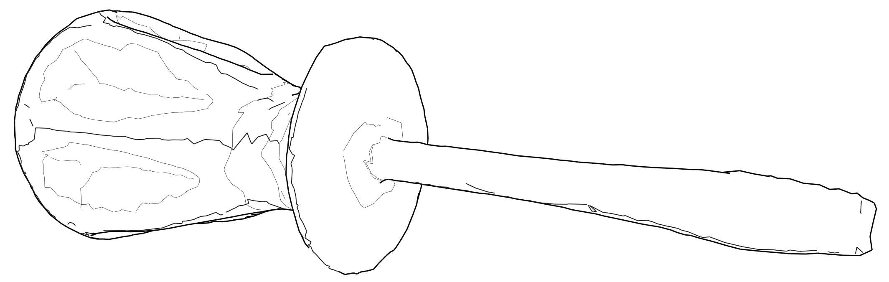
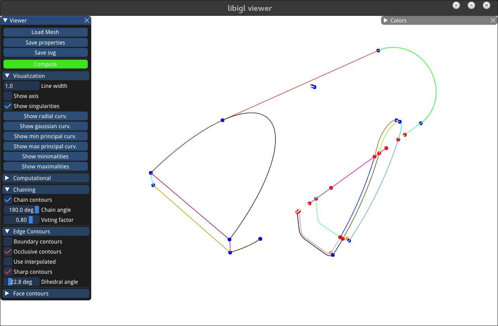

# SynDraw : Synthetic Drawings Generator



SynDraw is a tool based on libIGL and tailored to generate **Synthetic Drawings** in a vector format from 3D triangular meshes. 

We use the state-of-the-art techniques described by P. Benard and A. Hertzmann in their 2018 paper to extract line paths on the surface of a 3D model with accurate visibility and chaining. Both **object-space** 3D and **image-space** 2D polylines are saved in an **SVG**.

We embed multiple selectable and **tunable line types** emerging from this field of research, such as creases, suggestive contours or demarcating curves.

The 3D data can then be used to guide a stylization algorithm, and eventually produce a final drawing. It can also serve as a machine learning **ground truth** in the task of retrieving geometry from sketches.

We provide tools aiming in that sense with **data augmentation** and optionnal labelling.


This tool was developped by [Bastien Wailly](mailto:bastien.wailly@inria.fr) and [Adele Saint-Denis](mailto:adele.sd@online.fr), under the supervision of [Adrien Bousseau](mailto:adrien.bousseau@inria.fr), as part of the D<sup>3</sup> ERC starting grant.


## Setup

#### Prerequisites

This build was successfully tested on Unix (Fedora) and macOS (Mojave, Catalina).

To install SynDraw, you must first install [libIGL](https://libigl.github.io) (globally or locally). 

#### Getting started

You can install SynDraw by cloning this repository :

``` bash
git clone https://gitlab.inria.fr/D3/contour-detect
cd "contour-detect/SynDraw"
mkdir build
cd build
cmake .. && make
```

This will build all the targets :  
* SynDraw : svg generator  
* SynDraw_Viewer : interactive viewer.
* SynDraw_Normal : normal map generator
* SynDraw_Batch : example of batch script in C++


## Using SynDraw

To use SynDraw, you must provide a valid properties file, where you can input all parameters including :

- Camera parameters (view, projection, viewport)
- Clean input 3D mesh (OBJ, OFF, PLY)
- Output SVG file
- Extraction parameters (line types, chaining, visibility, filtering, ...)

We provide a [template](./SynDraw/template.properties) that you can edit at your convenience.

More information about parameters can be found in the Doxygen documentation [here](https://ns.inria.fr/d3/syndraw/doc/html/class_properties.html).

To call SynDraw, simply type :

```bash
./SynDraw -p path-to.properties
```

We also provide a simple C++ [example](./SynDraw/src/batch_main.cpp) to generate multiple outputs from a single 3D model, to avoid redundant computations. 


## Interactive viewer

You can use the provided viewer executable  to load a 3D model and interactively test all parameters in the properties file. This can be helpful to figure out a good template and values bounds for a given dataset.

To open the viewer, type in :

```bash
./SynDraw_Viewer
```



You will be queried to select a 3D mesh from your file system.

You can freely edit any parameter.

At any moment, you can save the current parameters to a file, which can then be used to drive the offline executable. 

You can also save the current screen in an SVG.


## Normal generator

We provide an executable to generate a normal map aligned with a given sketch. This executable takes as input the same properties file.

```bash
./SynDraw_Normal -p path-to.properties -o output.png -m mode -b opacity
```
Opacity is the alpha channel value of the background. If set to 1, the background is a middle grey (normal=[0,0,0]).  
Mode specifies the interpolation for normals : 1 for vertex-based, 2 for face-based.  

## Other tools

We provide optionnal tools for further processing of the SVG :

- Parsing paths and polylines
- Resampling for clamping point density
- Adding noise : per-point 1D noise, per-stroke 2D transform, global 2D transform
- Rasterizing to PNG using CairoSVG

You can find them and their readmes in the **svg_tools** folder.

