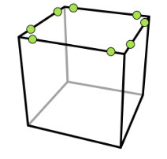
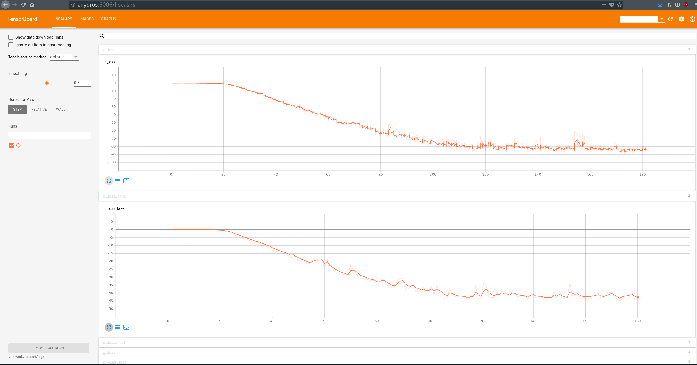
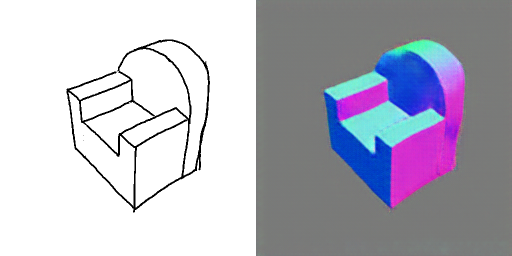
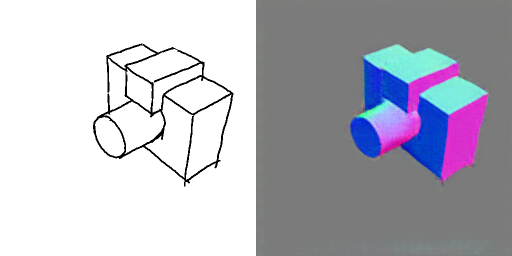
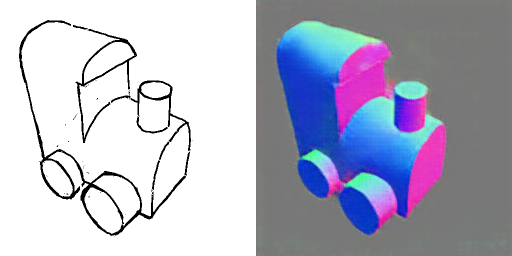
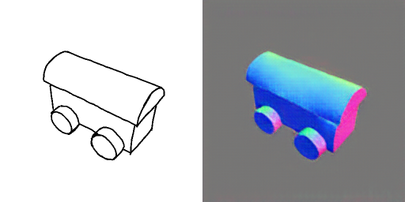
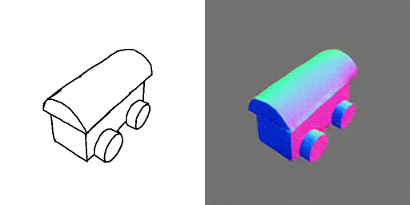

# Introduction

As a tutorial, we are proposing to replicate the normal map prediction network from [Delanoy 2019].
The idea is to use [Su 2018] pix2pix network to generate a normal map from a sketch.

We will use SynDraw to generate sketch depictions of the meshes used by Delanoy, along with the aligned normal map. We will then train Su's network to generate the normal map from the sketch as input.  

Finally, we will input real sketches to illustrate the network's performance on this particular task.  

Delanoy 2019 : https://ns.inria.fr/d3/3DSketching/  
Su 2018 : https://github.com/Ansire/sketch2normal

# Setup

Before anything, you need to install those python modules :

* numpy
* Pillow
* argparse
* virtualenv
* cairo
* pyjavaproperties

```bash
 pip install numpy Pillow argparse virtualenv CairoSVG==1.0.22 pyjavaproperties --user 
```

# Data generation

The first thing to do is to download Delanoy's meshes and sketches :
   
- Meshes : https://ns.inria.fr/d3/SynDraw/off.zip (extract it in `./off/` folder)  
- Sketches : https://ns.inria.fr/d3/SynDraw/sketches.zip  (extract it in `./sketches/` folder)  

We will use camera parameters equivalent to the ones used by Delanoy. All 20k meshes will be rendered from these 8 viewpoints.  



We use SynDraw interactive viewer and loaded one of the meshes to pin down good extraction parameters and camera parameters. We saved the resulting parameters in the `template.properties` file in this folder.  
This template will be used to guide the synthesis of all images.

To generate all images from the meshes, use :

```bash
python ./1_generate.py -nb_data 20000
```

This command will, for each mesh and viewpoint :  

* Generate a properties files by editing the input mesh, output SVG and camera position entries of the template
* Generate the SVG corresponding to the mesh viewed under the given viewpoint
* Generate the normal map aligned with this SVG
* Resample the SVG to have uniform point density
* Add vector noise to simulate hand drawing imperfections
* Rasterize the SVG to a PNG

In the end, we will then have a 160k entries dataset with sketch and aligned normals that we will use to train pix2pix.

# Packing

Once all images are generated, we need to pack them to a Tensorflow-style dataset.  
To do that, type in : 

```bash
python ./2_pack.py -contours_dir ./png/ -normals_dir ./normals/ 
					-dataset_dir ./dataset/ -start 0 -nb 20000 -nb_data 20000
```

This will create a folder named `dataset` in the root containing all training data needed by Tensorflow.


# Training

We will be using a python3 virtual environment to train Su's network. To set it up, enter :  

```bash   
virtualenv -p python3.6 virt_py3  
source ./virt_py3/bin/activate  
pip3 install numpy scipy==1.1.0 tensorflow=1.10.1 Pillow
```

We want to train our network with 5 epochs. To launch the training, type in :  

```bash
python ./3_train.py --dataset_name dataset --epoch 5
```

The network's weights, logs and samples will be stored in `./network/dataset/`.  
You can check out the training process with Tensorboard :  

```bash
tensorboard --logdir ./network/dataset/logs
```



# Testing

Once the training is complete, we will be using Delanoy' real sketches to assess the performance of the network.  

Type this in your terminal to run the generator part of the network on all the real sketches we have. The resulting normal maps will be located in `./sketches/out`.
  
```bash
python ./4_test.py  --phase test --dataset_name dataset --test_dir ./sketches
					--checkpoint_dir ./network/dataset/checkpoint/ 
```

Examples of prediction :  





